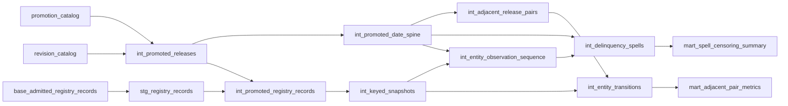
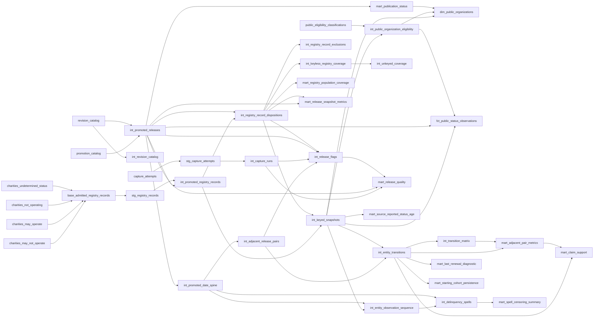

# California Charity Registry Monitor

An automated longitudinal data pipeline for California's published charity registry population, with a historical analysis of three accepted releases. Python admits source files; DuckDB and dbt SQL model the history; Power BI presents governed output.

**Current scope:** v1 covers July 15, August 5 and August 19, 2026. California retired the original four-file publication on September 2, 2026. The capture workflow continues checking candidates against the source contract; incompatible files are rejected, preserving the accepted history. The three-release window reflects the end of that source series. Adopting the successor publication is future work requiring new source and metric contracts.

`calico` reads as **cali**fornia **c**harity **o**bservatory: a cat pun that also expands to the subject, following the same pattern as `retrocat`. The formal project name is California Charity Registry Monitor.

## Build, measure, retire

Historical commercial investigation: built the system, then measured whether it should exist, and retired it on the evidence. The commercial investigation did not substantiate a forced platform event; amnesty response did not support intervention; observed unassisted resolutions weakened the value hypothesis; external segmentation did not establish a reliable targeting rule; and renewal costs constrained the commercial proposition. These are qualitative historical findings, not calculations from this monitor.

Known limitation: no organization was interviewed about willingness to pay. The retained engineering artifact explains the measurements and their limits.

Clarification: the retirement described here concerns the commercial proposition. The registry pipeline and its longitudinal history are retained; the source publication retirement described above separately ended new observations under the v1 contract.

## Report

[Phase 10 report URL slot]

A Publish to web report URL and final owner acceptance belong to Phase 10. The written walkthrough is linked below.

## Questions

- How does the published registry population change between accepted releases?
- Which observed cohorts remain in the published delinquent population?
- What source-reported compliance history is available for a selected organization?
- What do schema, capture and reconciliation checks show about each source release?

## Deliberate non-claims

This is not an Attorney General system. It does not measure internal workload, staffing, processing time, enforcement performance, intent or cause. A source-reported category is an observation, not a legal or compliance outcome; disappearance is not cure. No trust, risk, fraud, quality or robustness score, ranking, partner recommendation or worst-organization leaderboard is produced.

The bounded history lookup intentionally permits organization name, exact full State Charity Reg#, city/state and observed categories. Excluded identifiers, street addresses, people, contacts, raw source columns and unapproved joins remain private.

## SQL-first responsibility boundary

Python owns downloading, hashing, decoding, structural admission and provenance. DuckDB/dbt SQL own promotion, exact-key transitions, contiguous observed spells, cohorts, diagnostics, reconciliation and every published metric. Power BI renders the governed output; it does not recreate business logic. No LLM sits between a source row and a published number.

## Architecture

<!-- calico:architecture:start -->


An immediate-edge subset of the fixture graph. The full lineage below includes all source lists and publication paths. Fixture lineage proves architecture, not real-data figures.
<!-- calico:architecture:end -->

## Data grains

<!-- calico:grains:start -->
| Grain | Owning relation |
|---|---|
| Landed source record | `base_admitted_registry_records` |
| Keyed snapshot | `int_keyed_snapshots` |
| Unkeyed coverage | `int_unkeyed_coverage` |
| Transition | `int_entity_transitions` |
| Status spell | `int_delinquency_spells` |
| Capture run | `int_capture_runs` |
| Release flag | `int_release_flags` |
| Aggregate report mart | `mart_registry_population_coverage` |
| Public organization | `dim_public_organizations` |
| Public status observation | `fct_public_status_observations` |
<!-- calico:grains:end -->

The [model-grain contracts](docs/model-grains.md) explain each owner and helper relation. Exact registration keys and full release identity prevent substring matching and revision/time-point confusion.

## Source path

California Attorney General [Registry reports](https://oag.ca.gov/charities/reports) supply the contracted registry lists. Landing verifies bytes before admission; current registry CSV decodes as CP1252 with QUOTE_NONE. The files contain no embedded record newlines; a newline-aware reader reproduces quote fusion. See the [capture runbook](docs/capture-runbook.md).

Accepted derived tables and provenance live on the [published-data branch](https://github.com/mrnouiouat/calico/tree/published-data). The current official Registry Search Tool linked by the Registry reports page is the verification authority; the monitor is an observation history.

## Build modes

**Fixture:** public, offline and reproducible; synthetic inputs reproduce the defect shapes without real identities. **Real:** explicit owner-controlled admitted store outside Git, verified against committed catalog anchors; the same SQL DAG and tests run after preflight. The raw archive is private, so the public checkout cannot rerun all historical real-data findings. See [build modes](docs/build-modes.md).

## Metric definitions

<!-- calico:metrics:start -->
The published delinquent population uses exactly `Delinquent` and `Delinquent - Late Fees Due`.

The following descriptions are copied from [governed dbt metric definitions](dbt/models/marts/metrics.yml):
- `starting_delinquent_count`: Starting published delinquent population at the exact endpoint pair.
- `still_delinquent_count`: Starting published delinquent population observed in that population at the endpoint.
- `observed_exit_count`: Starting published delinquent population observed outside the closed statuses at the endpoint.
- `not_observed_count`: Starting published delinquent population absent at the endpoint; never an observed exit.

The source-reported Last Renewal measures are release-quality diagnostics. Their denominator definitions are copied from the [denominator contract](contracts/metric-denominators-v1.json):
- `all_observed_exits_v1`: All exact-key records classified by the authoritative transition relation as delinquency_exit_observed for the accepted-release pair.
- `observed_exits_with_populated_start_v1`: Observed exits whose source-reported Last Renewal value is populated at the start, including nonblank values that are unparseable as dates.
- `starting_delinquent_diagnostic_clears_v1`: Starting published delinquent population records observed at both endpoints with a populated source-reported Last Renewal value at start and a blank value at end.

Conditional precision uses starting published delinquent population diagnostic clears; eligible-exit sensitivity uses observed exits with a populated start value; all-exit sensitivity uses all observed exits. A null ratio has a zero denominator, never an invented result.
Starting-cohort persistence uses actual accepted-release endpoints; a not-observed endpoint stays separate and no missing horizon is bridged. Interval proportions retain their actual calendar gap and SQL-computed Wilson bounds. Spell bounds are observation bounds, with censoring shown explicitly.
<!-- calico:metrics:end -->

<!-- calico:claims:start -->
Between the July 15 and August 5 releases, 7,737 matched organizations were observed moving from `Current - Reporting Incomplete` into a delinquent category; most of the entry cohort carries a source-reported July 17 status date; the public files do not establish internal cause, exact processing time, or workflow. Across the next pair, total delinquency entries fell from 7,750 to 2, supporting a descriptive claim of a discrete bulk publication event rather than a steady flow.

Evidence: [governed claim contract](contracts/claim-support-v1.json), claim contract version `1`, SQL relation version `claim_support_status_movement_v1`; published export SHA-256 `a4a500ac6a07f6392ef894321aa4a118ef96186f37c3de2cb99c15238c85573a`.
Release source fingerprints: `e7d025f771be28d1508cb68ee796c301ffd326037840c95a2c13156ca5fb4096`, `7ad3ab19817a1313620f611713f58715b87734a0533d8e27e9ee71425602216f`, `903ca83cb4a17942e3daa5e02eb062a01c55609f888482a99b21c6036ead8876`; parser `registry-csv-contract-v1`. These are observed publication changes.
<!-- calico:claims:end -->

## Limitations

The final three-release panel is bounded by the accepted identities below. It is a longitudinal history across those observations; continuing the series requires a compatible source. Source publication retirement is recorded by the pinned capture status below; future capture failures do not extend this panel. Official-portal staleness remains unresolved and pending verification; the historical approximate lag is not a settled current fact.

Observed exit, not observed and right censoring remain distinct. Source-reported dates do not establish onset, filing time, continuous status, intent or cause. No annualized rate or formal survival estimate is inferred. Every identifiable registration key publishes by default; an explicit private sidecar entry is the exclusion mechanism. The exact inspected export/semantic inventory remains authoritative.

## Accepted release and latest capture attempt

<!-- calico:identity:start -->
Accepted identity is from the publication manifest and the committed input catalog, independently of capture outcome.

Pinned published-data commit: `c35e88618fc78f6f8ddcb1f6e3f8dbd68b42b3ba`.
Publication manifest SHA-256: `da4f4a3385f674adc4aea66044ad977a8f8dea86fdc10a7ca5607f918755e7ed`.
Parser: `registry-csv-contract-v1`; publication authority: `publication-exports-v3`.

| Accepted as-of date | Revision | Source fingerprint SHA-256 | Revision manifest SHA-256 |
|---|---|---|---|
| 2026-07-15 | 1 | `e7d025f771be28d1508cb68ee796c301ffd326037840c95a2c13156ca5fb4096` | `b0897b60d6f5923aa989a3988b642f19b68998a6b0c3bf280a72b21320531969` |
| 2026-08-05 | 1 | `7ad3ab19817a1313620f611713f58715b87734a0533d8e27e9ee71425602216f` | `b6d50fef623789a07774d5e253ba9dcf62311abfadf9d9300a10a864972f82a9` |
| 2026-08-19 | 1 | `903ca83cb4a17942e3daa5e02eb062a01c55609f888482a99b21c6036ead8876` | `3ee18bed812cb639816dfe31dd687d7b679a52eb4311e33565c19aac325d1553` |

Exact source-object hashes are retained in the [pinned input evidence](docs/evidence/public-readme-inputs-v1.json).
Release rule versions copied from governed SQL output:
- 2026-07-15: `capture_outcome_available_v1:1:linked-accepted-or-recovered-capture-run-v1,parser_contract_version_known_v1:1:known-parser-contract-version-1-v1`; source fingerprint `e7d025f771be28d1508cb68ee796c301ffd326037840c95a2c13156ca5fb4096`.
- 2026-08-05: `capture_outcome_available_v1:1:linked-accepted-or-recovered-capture-run-v1,parser_contract_version_known_v1:1:known-parser-contract-version-1-v1`; source fingerprint `7ad3ab19817a1313620f611713f58715b87734a0533d8e27e9ee71425602216f`.
- 2026-08-19: `capture_outcome_available_v1:1:linked-accepted-or-recovered-capture-run-v1,parser_contract_version_known_v1:1:known-parser-contract-version-1-v1`; source fingerprint `903ca83cb4a17942e3daa5e02eb062a01c55609f888482a99b21c6036ead8876`.
<!-- calico:identity:end -->

<!-- calico:refresh:start -->
Latest capture started: `2026-10-01T03:52:00.087Z`; ended: `2026-10-01T03:56:55.950Z`.
Outcome: `rejected`; reason: `source_contract_mismatch`.
Capture status SHA-256: `f544b885cc2d5ec71b042ae6ab9eadddeac8fe31040bb7b672c2f800a1c49912`; contract: `capture-status-v3`.
Source publication state: `retired`; retired on `2026-09-02`.

A rejected or operationally failed attempt does not advance or erase accepted release identity.

Report updates use a documented manual Power BI Refresh now step. The report is not fully automatic.
<!-- calico:refresh:end -->

See the [Power BI refresh runbook](docs/powerbi-refresh-runbook.md) for native manual refresh and official verification.

## dbt lineage

<!-- calico:lineage:start -->


Generated from the [safe fixture projection](docs/evidence/dbt-lineage-v1.json); source model hashes and immediate edges are checked offline. Raw dbt manifests, compiled SQL, profiles and runtime paths are not published.
<!-- calico:lineage:end -->

## Techniques demonstrated

Window functions, deterministic revision promotion, exact-key adjacent-release joins and anti-joins, gaps-and-islands with observation censoring, conditional aggregation, denominator contracts, schema/reconciliation assertions, immutable source hashes and atomic publication. Complexity is not a target: each technique answers a bounded source question.

## Annotated SQL excerpts

<!-- calico:excerpts:start -->
**int_promoted_releases** — A matching promotion pointer wins first; otherwise the highest accepted revision wins for that date. Revisions never create a new time point.

Source: [model](dbt/models/intermediate/int_promoted_releases.sql), ranges 22–46 (selections concatenated in source order). Source bytes SHA-256 `d5a74abb3103a5564a647a3b706df7ece0ed31491bbc7f68b5bd8df7f912bfd2`; selected bytes SHA-256 `cabe9a0bee9d13a2f9236ec34c25095a15c2da4c062f544669680b08e2d447bd`.

```sql

    select
        r.as_of_date,
        r.release_revision,
        r.revision_fingerprint,
        r.parser_contract_version,
        row_number() over (
            partition by r.as_of_date
            order by (p.release_revision is not null) desc, r.release_revision desc
        ) as promotion_rank
    from {{ source('runtime_input', 'revision_catalog') }} r
    left join {{ source('runtime_input', 'promotion_catalog') }} p
      on r.as_of_date = p.as_of_date
     and r.release_revision = p.release_revision
     and r.revision_fingerprint = p.revision_fingerprint

)

select
    as_of_date,
    release_revision,
    revision_fingerprint,
    parser_contract_version
from ranked
where promotion_rank = 1
```

**int_entity_transitions** — The first source range matches the full registration key and both release identities. The second uses an anti-join to retain a missing endpoint; absence never becomes an invented status.

Source: [model](dbt/models/intermediate/int_entity_transitions.sql), ranges 114–122, 153–161 (selections concatenated in source order). Source bytes SHA-256 `fc7531e2aa71fe6480a8d5d6828931b2a0bf4eca57df788338894a73426ba9c9`; selected bytes SHA-256 `0e907c3e2e742d7eb1d782d1142013e75fb703c947a705314d5289e181c77804`.

```sql
    from start_observations as s
    inner join end_observations as e
        on s.from_as_of_date = e.from_as_of_date
       and s.from_release_revision = e.from_release_revision
       and s.from_revision_fingerprint = e.from_revision_fingerprint
       and s.to_as_of_date = e.to_as_of_date
       and s.to_release_revision = e.to_release_revision
       and s.to_revision_fingerprint = e.to_revision_fingerprint
       and s.state_charity_registration_number = e.state_charity_registration_number
    from start_observations as s
    anti join end_observations as e
        on s.from_as_of_date = e.from_as_of_date
       and s.from_release_revision = e.from_release_revision
       and s.from_revision_fingerprint = e.from_revision_fingerprint
       and s.to_as_of_date = e.to_as_of_date
       and s.to_release_revision = e.to_release_revision
       and s.to_revision_fingerprint = e.to_revision_fingerprint
       and s.state_charity_registration_number = e.state_charity_registration_number
```

**int_delinquency_spells** — A gap or observed non-delinquent neighbor starts a new island. A cumulative window numbers observed spells; the full model keeps onset and exit bounded and censoring explicit.

Source: [model](dbt/models/intermediate/int_delinquency_spells.sql), ranges 54–78 (selections concatenated in source order). Source bytes SHA-256 `5843b4eadf4fa36098e2a034ce3058347d411ccde71b61ed7711eefdc49006f3`; selected bytes SHA-256 `e3c001707d14aeeaf2235bc696fe72d7616306f819004f3010fd1afde085dfb1`.

```sql
        *,
        case
            when prior_observation_ordinal is null then true
            when not prior_is_delinquent then true
            when prior_observation_ordinal != observation_ordinal - 1 then true
            else false
        end as is_island_start

    from delinquent_observations

),

island_numbering as (

    select

        *,
        sum(case when is_island_start then 1 else 0 end) over (
            partition by state_charity_registration_number
            order by observation_ordinal
            rows between unbounded preceding and current row
        ) as spell_number

    from island_start_flags

```
<!-- calico:excerpts:end -->

## Why the investigation trail is here

The [investigation trail](docs/provenance/) keeps the migration record, Gate A evidence and spikes because a reader should see which interpretations failed and which figures were corrected. Machine-parseable banners distinguish historical bodies from current authority; supersedes pairs preserve predecessors. The byte/hash chain is in the [provenance index](docs/provenance/index-v1.json), and cited authority IDs resolve through the [public decision register](docs/decisions/register.md).

Private planning is excluded: the [boundary decision](docs/decisions/planning-directory-not-published.md) explains the curated public surface. The archive and personal working record are not reproduction inputs.

## How to reproduce

From a clean product checkout, create and activate a Python environment, then install the pinned analytical requirements:

```sh
python -m venv .venv
python -m pip install -r requirements-dbt.txt
python -m calico_dbt build --mode fixture
python -m calico_dbt docs --mode fixture
python -m tools.docs_public check
python -m tools.citation_scan --check
python -m unittest tests.docs_public.test_readme tests.docs_public.test_lineage -q
python -m tools.privacy_scan --tree HEAD --history-all
```

The docs check is offline and makes no edits. An intentional evidence refresh first fetches origin/published-data, then passes its full immutable commit to `python -m tools.docs_public inputs --published-ref <full-commit>`, followed by `python -m tools.docs_public generate`. Review, regenerate citations, test and privacy-scan before committing. See [build modes](docs/build-modes.md) for real-mode requirements.

Code and documentation use the [MIT license](LICENSE). Registry-derived data comes from a California public record, attributed to the California Attorney General Registry of Charities and Fundraisers through the source link above. This does not assign a new data license or claim public-domain status. The code license provides no warranty for source-reported registry data; the monitor does not replace the current official record.

<!-- calico:walkthrough:start -->
Walkthrough: [Read the written walkthrough](docs/walkthrough.md).
<!-- calico:walkthrough:end -->
